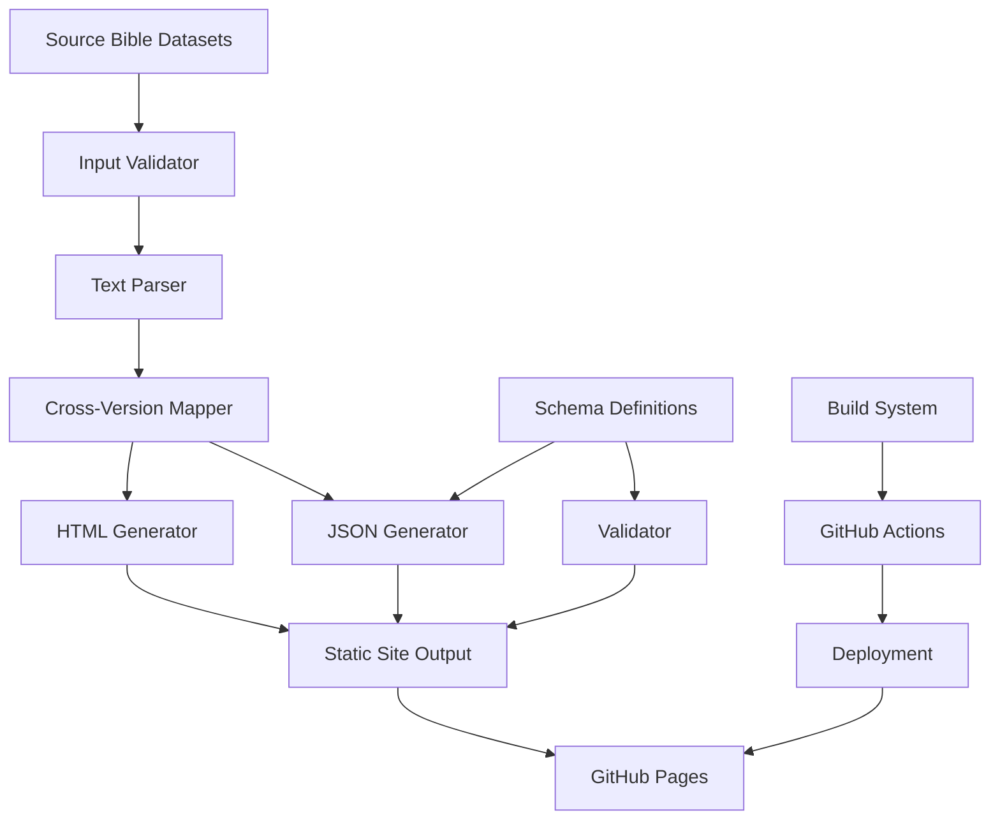

# Design Document

## Overview

The Bible Static Generator is a Rust-based build system that transforms public-domain Bible datasets into a comprehensive static website hosted on GitHub Pages. The system generates both human-readable HTML pages and machine-readable JSON APIs, with deterministic output, cross-version mapping, and automated deployment.

### Key Design Principles

- **Deterministic Generation**: Identical inputs produce identical outputs for reproducible builds
- **Performance Optimization**: Chapter-level granularity balances file size with access speed
- **GitHub Pages Compatibility**: Static-only architecture with HTML-based redirects
- **Schema Versioning**: Forward and backward compatibility through versioned JSON schemas
- **Accessibility First**: Semantic HTML with automated accessibility validation

## Architecture

### High-Level Architecture



### Directory Structure

```
output/
├── manifest.json                    # Global manifest with API discovery
├── schema/                          # Schema definitions with versioning
│   ├── manifest-1.0.json
│   ├── chapter-1.0.json
│   ├── books-1.0.json
│   ├── versions-1.0.json
│   └── crossrefs-1.0.json
├── kjv/                            # Version directories
│   ├── genesis/
│   │   ├── 1.json                  # Chapter JSON with stable keys
│   │   ├── 1.json.gz               # Optional compressed artifacts
│   │   ├── 1.html                  # Chapter HTML with anchors
│   │   └── ...
│   └── ...
├── bible/                          # Short URL redirects
│   └── {id}/
│       └── {book}.{chapter}.{verse}.{version}.html
├── books.json                      # Global book metadata
├── versions.json                   # Available versions
├── crossrefs.json                  # Cross-version mappings with null handling
└── index.html                      # Site homepage with manifest links
```

## Components and Interfaces

### 1. Input Validation Component

**Purpose**: Validates and sanitizes source Bible datasets

**Interface**:
```typescript
interface InputValidator {
  validateDataset(source: SourceText): ValidationResult;
  sanitizeText(text: string): string;
  detectDuplicates(verses: Verse[]): DuplicateReport;
}

interface ValidationResult {
  isValid: boolean;
  errors: ValidationError[];
  warnings: ValidationWarning[];
  statistics: DatasetStatistics;
}
```

**Key Features**:
- Malformed verse detection using regex patterns
- Duplicate verse identification within chapters
- HTML entity encoding for security with inline script prohibition
- Comprehensive diagnostic logging in JSONL format with log rotation (10 builds max)
- Gap detection for missing verses with continued processing

### 2. Text Parser Component

**Purpose**: Converts raw text into structured verse objects

**Interface**:
```typescript
interface TextParser {
  parseChapter(text: string, book: string, chapter: number): Chapter;
  extractVerses(chapterText: string): Verse[];
  generateDeterministicIds(verse: Verse): string;
}

interface Chapter {
  book: string;
  chapter: number;
  verses: Map<string, Verse>;
  metadata: ChapterMetadata;
}
```

**Key Features**:
- Stable verse key generation (string keys, not array indices)
- Consistent parsing across different source formats
- Deterministic ID generation using content hashing

### 3. Cross-Version Mapping Component

**Purpose**: Creates mappings between equivalent verses across Bible versions

**Interface**:
```typescript
interface CrossVersionMapper {
  generateMappings(versions: BibleVersion[]): CrossReferenceMap;
  resolveConflicts(conflicts: MappingConflict[]): Resolution[];
  validateMappings(mappings: CrossReferenceMap): ValidationResult;
}

interface CrossReferenceMap {
  schema_version: string;
  mappings: {
    [canonicalRef: string]: {
      [version: string]: VerseReference | null;
    };
  };
  conflicts: MappingConflict[];
  null_entries: {
    [canonicalRef: string]: {
      version: string;
      reason: string; // Preserves semantic context for missing verses
    }[];
  };
}
```

**Algorithm Strategy**:
1. **Primary**: Canonical verse number matching (book.chapter.verse)
2. **Fallback**: Textual similarity analysis for numbering discrepancies
3. **Conflict Resolution**: Store null entries with reason field for missing verses

*Detailed algorithm specification: `/docs/crossrefs-algorithm.md`*

### 4. HTML Generator Component

**Purpose**: Creates accessible, semantic HTML pages

**Interface**:
```typescript
interface HtmlGenerator {
  generateChapterPage(chapter: Chapter, version: string): string;
  generateIndexPage(versions: BibleVersion[]): string;
  generateRedirectPage(target: VerseReference): string;
  generateNavigation(context: NavigationContext): string;
}
```

**Key Features**:
- Semantic HTML5 structure (main, nav, section, article)
- ARIA roles and labels for accessibility
- Stable verse anchors (#v{number}) with clickable verse numbers
- Skip links for keyboard navigation and proper heading hierarchy
- Canonical link elements in redirect pages using meta refresh for GitHub Pages
- Automated accessibility validation using axe-core or pa11y

### 5. JSON Generator Component

**Purpose**: Creates structured JSON API files

**Interface**:
```typescript
interface JsonGenerator {
  generateChapterJson(chapter: Chapter): ChapterJson;
  generateMetadataFiles(versions: BibleVersion[]): MetadataFiles;
  validateSchema(json: object, schemaPath: string): boolean;
  minifyOutput(json: object): string;
}

interface ChapterJson {
  schema_version: string;
  book: string;
  chapter: number;
  version: string;
  verses: { [key: string]: string };
  metadata: ChapterMetadata;
  extensions: Record<string, unknown>; // Future extensibility
}
```

**Key Features**:
- Chapter-level granularity for optimal performance
- Stable verse keys as object properties (not array indices)
- Schema validation before output with backward compatibility testing
- JSON minification and optional precompressed .json.gz artifacts with application/gzip MIME type
- Extension fields for future compatibility and non-breaking additions

### 6. Manifest Generator Component

**Purpose**: Creates global manifest for API discovery and build metadata

**Interface**:
```typescript
interface ManifestGenerator {
  generateManifest(versions: BibleVersion[], buildMetadata: BuildMetadata): GlobalManifest;
  validateManifest(manifest: GlobalManifest): boolean;
  updateManifestAtomically(manifest: GlobalManifest): void;
}

interface GlobalManifest {
  schema_version: string;
  build_timestamp: string;
  source_checksums: { [version: string]: string };
  available_versions: string[];
  api_endpoints: {
    versions: string;
    books: string;
    crossrefs: string;
    chapters: string; // Template: /{version}/{book}/{chapter}.json
  };
  schema_locations: { [schema: string]: string };
  extensions: Record<string, unknown>;
}
```

**Key Features**:
- Atomic updates to signal successful build completion
- Source dataset checksums for integrity verification
- API endpoint discovery for programmatic access
- Schema location mapping for validation
- Build metadata including timestamp and version information

## Data Models

### Core Data Structures

```typescript
// Source text representation
interface SourceText {
  version: string;
  books: BookData[];
  metadata: SourceMetadata;
}

interface BookData {
  name: string;
  abbreviation: string;
  chapters: ChapterData[];
}

interface ChapterData {
  number: number;
  verses: VerseData[];
}

interface VerseData {
  number: string; // Support for verse ranges like "1-2"
  text: string;
  footnotes?: string[];
}

// Generated output structures
interface Verse {
  id: string;
  number: string;
  text: string;
  anchor: string; // #v{number}
  canonicalRef: string; // book.chapter.verse
}

interface BibleVersion {
  code: string; // kjv, asv, web, oeb
  name: string;
  description: string;
  books: BookReference[];
  metadata: VersionMetadata;
}

interface BookReference {
  name: string;
  abbreviation: string;
  chapters: number;
  testament: 'old' | 'new';
}
```

### Schema Definitions

All JSON output follows versioned schemas stored in `/schema/` directory using semantic versioning:

- `manifest-1.0.json`: Global manifest schema
- `chapter-1.0.json`: Chapter JSON schema  
- `books-1.0.json`: Books metadata schema
- `versions-1.0.json`: Versions metadata schema
- `crossrefs-1.0.json`: Cross-references schema

*Schema files use semantic versioning (major.minor format) for compatibility tracking*

## Error Handling

### Validation and Logging Strategy

```typescript
interface DiagnosticLogger {
  log(level: 'info' | 'warning' | 'error', message: string, context?: object): void;
  generateReport(): DiagnosticReport;
  rotateLogs(maxBuilds: number): void;
}

interface DiagnosticReport {
  buildId: string;
  timestamp: string;
  summary: {
    errors: number;
    warnings: number;
    processed: ProcessingStats;
  };
  entries: LogEntry[];
}
```

### Error Recovery Patterns

1. **Missing Verses**: Log gap, continue processing, mark as null in cross-references
2. **Malformed Text**: Sanitize content, log warning, include corrected version
3. **Schema Violations**: Fail fast with detailed error report
4. **Build Failures**: Preserve previous successful build, generate diagnostic report

### Logging Retention

- JSONL format for structured logging
- Rotate logs automatically (delete oldest when > 10 builds)
- Severity levels: info, warning, error
- Contextual information for debugging

## Testing Strategy

### Automated Testing Approach

```typescript
interface TestSuite {
  validateDeterministicOutput(): TestResult;
  verifyAnchorLinks(): TestResult;
  testRedirectRouting(): TestResult;
  validateAccessibility(): TestResult;
  checkSchemaCompliance(): TestResult;
}
```

### Test Categories

1. **Unit Tests**: Individual component functionality
2. **Integration Tests**: End-to-end build process
3. **Deterministic Output Tests**: Automated verification of output hashes (Requirement 12.1)
4. **Link Validation Tests**: Verify all verse anchor links function correctly (Requirement 12.2)
5. **Redirect Tests**: Test short URL redirects for proper routing (Requirement 12.3)
6. **Cross-Version Mapping Tests**: Verify mapping accuracy through automated comparison (Requirement 12.4)
7. **Accessibility Tests**: Automated axe-core/pa11y validation (Requirement 10.5)
8. **Performance Tests**: Build time and file size verification
9. **Schema Tests**: JSON validation and backward compatibility testing (Requirement 9.6)
10. **Comprehensive Test Reports**: Schema compliance, data integrity, and accessibility verification (Requirement 12.5)

### Deterministic Output Verification

- Generate content hashes for all output files
- Compare hashes across multiple builds with identical input
- Verify timestamp and metadata consistency
- Test reproducibility across different environments

## Performance Optimization

### Build Performance Targets

- **Total Build Time**: < 2 minutes on GitHub Actions standard runners (Requirement 11.3)
- **HTML File Size**: < 50 KB per chapter page (Requirement 11.1)
- **JSON Compression**: Minification + optional precompressed .json.gz artifacts with application/gzip MIME type (Requirement 11.2)
- **Repository Size**: Optimized for Git operations and GitHub Pages limits (Requirement 11.5)
- **Asset Loading**: Optimized for GitHub Pages hosting constraints (Requirement 11.4)

### Optimization Strategies

1. **Parallel Processing**: Generate chapters concurrently
2. **Incremental Builds**: Only regenerate changed content (future enhancement)
3. **Asset Optimization**: Minimize HTML markup, compress JSON
4. **Caching Strategy**: Leverage GitHub Actions caching for dependencies

### Memory Management

- Stream processing for large datasets using Rust's zero-cost abstractions
- Memory safety guarantees through Rust's ownership system
- Efficient data structures for cross-version mapping with minimal allocations
- Memory-mapped file access for source texts using platform-specific optimizations

## Deployment and CI/CD

### GitHub Actions Workflow

```yaml
# Simplified workflow structure
name: Build and Deploy Bible Site
on:
  push:
    paths: ['datasets/**']
  schedule:
    - cron: '0 2 * * 0' # Weekly rebuild

jobs:
  build:
    runs-on: ubuntu-latest
    steps:
      - name: Validate Input
      - name: Generate Site
      - name: Verify Deterministic Output  # Requirement 12.1
      - name: Run Tests
      - name: Deploy to Pages
```

### Deployment Strategy

1. **Source Control**: Bible datasets in `/datasets/` directory
2. **Trigger Events**: Push to datasets, manual dispatch, scheduled builds
3. **Build Validation**: Comprehensive testing before deployment
4. **Atomic Deployment**: Update manifest.json last to signal completion
5. **Rollback Capability**: Preserve previous build for emergency rollback

### Security Considerations

- Mask secrets in build logs (Requirement 13.5)
- Exclude sensitive data from deployment artifacts (Requirement 13.5)
- Sanitize all text content using HTML entity encoding (Requirement 8.5)
- Prohibit inline scripts in all generated content (Requirement 8.5)
- Validate all external inputs and dependencies
- Secure handling of source datasets and build artifacts

## Future Extensibility

### Extension Points

1. **JSON Schema Extensions**: Reserved `extensions` field in all JSON outputs
2. **Additional Metadata**: Commentary, cross-references, study notes
3. **Multiple Output Formats**: EPUB, PDF generation capabilities
4. **Advanced Search**: Full-text search index generation
5. **Internationalization**: Multi-language interface support

### Backward Compatibility Strategy

- Schema versioning with migration paths
- Deprecated field support with warnings
- API endpoint versioning for breaking changes
- Documentation of compatibility matrices

This design provides a robust, scalable foundation for the Bible Static Generator while maintaining simplicity and GitHub Pages compatibility.